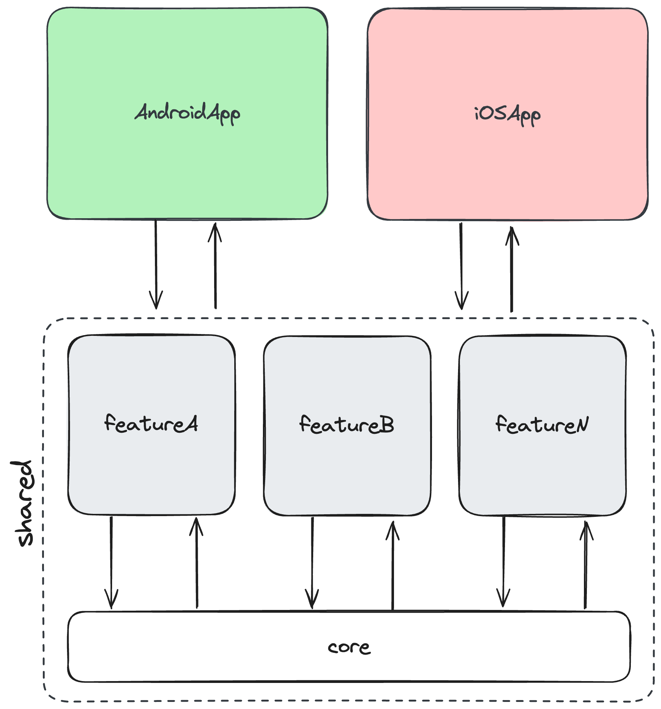

# Welcome! 👋

Welcome to the MarketplaceApp! This is a particular project to explore the Kotlin Multi Platform Framework 🤩

---

## How to run the project 📦

1. Install Android Studio (latest version);
2. KMM plugin;
3. Select the option to open a project;
4. Select the project
5. Build and Run

🍎 If you wants to run the iOS app, you should open the file `iosApp/iosApp.xcodeproj` (WIP).

---

## Project Status

- Android 
- iOS 
- Shared 
- UnitTest 
- Snapshot 

---

## Project Architecture

